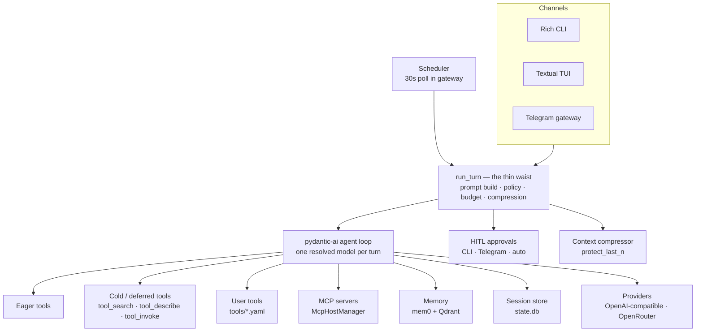

<div align="center">


# Lattice

**A thin-waist personal agent with profiles, MCP, memory, and HITL.**

[](https://github.com/kakalition/lattice/actions/workflows/ci.yml)
[](https://www.python.org/)
[](https://docs.astral.sh/uv/)
[](https://ai.pydantic.dev/)
[](https://textual.textualize.io/)
[](https://python-telegram-bot.org/)

</div>

Lattice is a single-user agent platform built around one narrow, well-tested turn
pipeline — the *thin waist*. Channels (a Rich CLI, a Textual TUI, and Telegram) all funnel
into the same `run_turn`, so profiles, memory, tools, safety, and observability behave
identically no matter where a message arrives. One model runs each turn; everything else is
composable around it.

## Table of Contents

- [Features](#features)
- [Architecture](#architecture)
- [Quick Start](#quick-start)
- [Configuration](#configuration)
- [CLI Reference](#cli-reference)
- [Profiles](#profiles)
- [Tools](#tools)
- [Skills](#skills)
- [Memory & Sessions](#memory--sessions)
- [Scheduler & Reminders](#scheduler--reminders)
- [SQLite](#sqlite)
- [Observability & Eval](#observability--eval)
- [Backup & Restore](#backup--restore)
- [Development](#development)
- [Security & Safety](#security--safety)
- [Project Layout](#project-layout)

## Features

| | Feature | What it does |
|---|---------|--------------|
| ⚙️ | **Thin waist** | One `run_turn` pipeline owns prompting, HITL, budgets, compression, and tool execution for every channel. |
| 🎭 | **Profiles & personas** | `profiles/<id>/{profile.yaml,SOUL.md,USER.md}`: persona, durable user notes, skill/tool policy, optional model and SQLite scope. Edits apply on the next turn. |
| 🧠 | **One model per turn** | A single resolved model drives the loop, context compression, and fact extraction. Profile override + sticky `/model` per channel and user. |
| 💸 | **Prompt caching** | Stable system prefix plus replayed history; volatile notices in the user tail. Cache tokens persisted per turn and visible in stats. |
| 🛡️ | **HITL safety** | Approval gates on high-blast-radius actions, with approval memory and a consecutive-denial breaker. Every decision lands in `audit.jsonl`. |
| 🗜️ | **Context compression** | Compresses long sessions while protecting the last `N` messages via `context_pressure_ratio` / `protect_last_n`. |
| 🧩 | **Skills** | `skills/<name>/SKILL.md` with YAML frontmatter and progressive disclosure; authoring ladder from skill → script → one tool manifest. |
| 🪢 | **Memory** | mem0 + local Qdrant under `.lattice/qdrant`, a bounded background worker, and a boot self-check that fails loudly. |
| 🔌 | **MCP bridge** | Attach MCP servers as toolsets, with deferral (`always` / `auto` / `never`) once the tool count crosses a threshold. |
| 🗄️ | **Multi-SQLite** | A named database registry with read-only options, safe pragmas, row/time limits, and HITL-gated destructive DDL. |
| ⏰ | **Scheduler & reminders** | Cron or one-shot jobs, verbatim reminder phrasing, delivered by the gateway to Telegram, CLI, or nowhere. |
| 🌐 | **Browser automation** | Playwright with a persistent profile, system-Chrome preference, and humanized input. |
| 👁️ | **Multimodal I/O** | OCR, PDF generation, and chart rendering as first-class tools. |
| 📊 | **Observability & offline eval** | `logs/turns.jsonl` turn records, `lattice stats`, and `lattice eval run` replaying a corpus through production `run_turn`. |
| 💬 | **Channels** | Rich CLI, Textual TUI, and a Telegram gateway that also polls the scheduler. |

## Architecture

Every channel converges on `run_turn`, the thin waist. The waist assembles the prompt,
applies profile and channel policy, runs HITL, and drives a pydantic-ai agent loop that can
call eager tools, deferred (cold) tools, user-defined tools, and MCP toolsets. Side systems
provide memory, session persistence, providers, the scheduler, and approvals.



## Quick Start

**Prerequisites:** Python 3.12+ and [uv](https://docs.astral.sh/uv/).

```bash
uv sync --extra dev

uv run lattice init          # create .lattice: layout, default profile, skill starters
uv run lattice doctor        # check config, keys, and profiles

uv run lattice chat -p default   # plain CLI chat
uv run lattice chat --tui        # graphical Textual terminal UI
uv run lattice gateway           # Telegram bot + scheduler
```

The first chat or gateway start runs one-time setup automatically (for example, installing
Playwright Chromium as a fallback). The browser prefers system Chrome and a persistent
profile under `.lattice/browser/profile`; see the `browser:` block in `lattice.yaml`.

## Configuration

Lattice separates non-secret settings, secrets, and runtime data into three layers.

| Layer | Path | Contents |
|-------|------|----------|
| Settings | `lattice.yaml` | Models, timezone, tools, budgets, browser, scripts, SQLite, Telegram tool policy, `default_profile`. |
| Secrets | `.env` | API keys and tokens only. Copy from [`.env.example`](.env.example). |
| Runtime | `.lattice/` | `state.db`, logs, Qdrant, browser profile, scheduler, skills, SQLite backups, workspace, scripts, tools. |

A representative `lattice.yaml`:

```yaml
timezone: Asia/Jakarta

agent:
  primary_model: <provider>/<model>
  iteration_budget: 60
  hitl_timeout_seconds: 600
  turn_timeout_seconds: 600        # legacy alias: idle_watchdog_seconds
  request_timeout_seconds: 120

observability:
  turn_record: true

tools:
  allow: ["*"]
  deny: []
  mcp_defer: auto                  # always | auto | never
  mcp_defer_threshold: 8
  search_strategy: bm25            # bm25 (default) | keywords
  search_min_ratio: 0.35           # drop BM25 matches under this fraction of the top score; 0 disables

browser:
  channel: auto                    # auto | chrome | chromium (auto prefers system Chrome)
  headed: false
  persistent_profile: true
  humanize: true

scripts:
  languages: [python, node, bash]
  timeout_seconds: 60
  max_timeout_seconds: 300
  allow_network: false
  require_bwrap: false             # true = refuse to run without bubblewrap

default_profile: default
```

Secrets come only from the project `.env` (see [`.env.example`](.env.example)):

| Key | Purpose |
|-----|---------|
| `OPENROUTER_API_KEY` | OpenRouter key. `OPENAI_API_KEY` is accepted as an alternative. |
| `TELEGRAM_TOKEN` | Telegram bot token for the gateway. |
| `TELEGRAM_CHAT_ID` | Default Telegram destination. |
| `TAVILY_API_KEY` | Web search via Tavily. |

> **Secrets are never read from YAML.** Loading settings scrubs `provider.api_key`,
> `telegram.token`, and `tavily_api_key` out of `lattice.yaml`, so secrets can only come
> from the `.env` file. Legacy `agent.model` is normalized to `agent.primary_model`.

## CLI Reference

| Command | Purpose | Notable flags |
|---------|---------|---------------|
| `lattice version` | Print the version. | — |
| `lattice init` | Create the `.lattice` layout, default profile, and skill starters. | `--reset` (archive + wipe first), `--home` |
| `lattice doctor` | Diagnose config, keys, and profiles. | `--home` |
| `lattice chat` | Interactive chat (CLI or TUI). | `-p/--profile`, `--tui`, `-w` (workspace), `--echo` |
| `lattice gateway` | Run the Telegram bot and scheduler gateway (pidfile-locked). | `--once` (one scheduler pass, no Telegram) |
| `lattice backup` | Compile `.lattice` into a portable archive. | `-o/--output`, `--include-logs`, `--home` |
| `lattice restore <archive>` | Restore an archive into the home directory. | `--force`/`-f`, `--home` |
| `lattice stats` | Aggregate `logs/turns.jsonl` into outcome/latency/cache stats. | `--days`, `--json`, `--home` |
| `lattice eval run` | Replay the eval corpus through production `run_turn`. | `--corpus`, `--json`, `--home` |
| `lattice eval mine` | Draft corpus rows from a real log, plus shell commands from audit. | `--log`, `--audit`, `--out`, `--limit`, `--home` |

## Profiles

A profile bundles a persona, durable user notes, and per-profile policy. `lattice init`
seeds a `default` profile automatically.

```
.lattice/profiles/<id>/
├── profile.yaml   # policy: skills, tools, memory collection, model, sqlite, workspace
├── SOUL.md        # persona: name + who the agent is, personality, style
└── USER.md        # durable notes about the user
```

```yaml
# profiles/<id>/profile.yaml
name: default
description: Default Lattice profile
skills:
  prefer: [telegram-chat, skill-authoring, session-hygiene, web-research]
  disable: []
tools:
  allow: ["*"]
  deny: []
memory:
  collection: lattice-default
# Optional: primary_model, sqlite.allow, workspace
```

- **`SOUL.md`** holds persona. An optional `name:` line sets the assistant's name (default
  `Lattice`); the rest is personality and conversation style.
- **`USER.md`** accumulates durable facts about the user.
- A built-in, immutable operating base ships in `src/lattice/assets/SOUL.md` and is separate
  from persona.
- **Policy precedence:** deny always wins over allow, and per-channel policy
  (`telegram.tools`) narrows the per-profile policy.
- Persona edits take effect on the next turn — no restart required.

## Tools

Lattice ships a core tool set and layers deferred discovery, user-defined tools, and MCP on
top.

### Core tools

| Domain | Tools |
|--------|-------|
| Files & shell | `shell`, `read_file`, `write_file`, `edit_file`, `remove_path`, `search_files` |
| Media & documents | `ocr`, `generate_pdf`, `generate_chart` |
| Web & browser | `web_search`, `web_fetch`, `browser_interact`, `browser_snapshot` |
| Code & compute | `execute_script`, `calculator` |
| Interaction | `clarify`, `todo` |
| Scheduling & time | `schedule_add`, `schedule_list`, `schedule_cancel`, `timezone_get`, `timezone_set` |
| Memory & sessions | `session_search`, `memory_search`, `memory_add`, `memory_update`, `memory_forget` |
| SQLite | `sqlite_list`, `sqlite_schema`, `sqlite_query`, `sqlite_execute`, `sqlite_register`, `sqlite_unregister`, `sqlite_backup` |
| Skills & profiles | `skills_list`, `skill_view`, `profile_list`, `profile_remove` |

### Discovery tools

`tool_search`, `tool_describe`, and `tool_invoke` expose the cold tier on demand. On
providers without native tool search, a pinned `search_tools` fallback ranks deferred
tools with in-process BM25 (IDF-weighted, so rare discriminating terms beat ubiquitous
ones; a curated per-tool alias table adds recall for terms like "graph" or "plot").
The `search_tools` description also lists the enabled cold core tools, so the model can
see what discovery reaches without a speculative search. `tools.search_min_ratio`
(default `0.35`) drops matches scoring below that fraction of the best match while always
keeping the top hit; `0` disables trimming. Set `tools.search_strategy: keywords` to
revert to the legacy token-overlap ranking.

### Tiers and policy

- **Eager** tools are always visible; **cold** tools are deferred behind discovery.
  Configure with `tools.eager` / `tools.cold` fnmatch globs (and built-in defaults).
- **MCP tools** form a toolset that can be wrapped in deferred loading. `tools.mcp_defer`
  chooses `always`, `auto`, or `never`; `auto` defers once tools exceed
  `tools.mcp_defer_threshold` (default `8`).
- **User tools** are declared in `tools/<name>.yaml` and flow through the same policy and
  HITL checks.
- `execute_script` prefers **bubblewrap** (`bwrap`) for sandboxing. Network access is off by
  default, and `scripts.require_bwrap: true` refuses to run without a sandbox (recommended on
  Linux; macOS falls back to a softer sandbox).

## Skills

Skills are folders with a `SKILL.md` and optional scripts. They use progressive disclosure:
the agent sees each skill's `name` and `description` in the index, then loads the full body
with `skill_view` only when relevant.

```
.lattice/skills/<name>/
├── SKILL.md            # YAML frontmatter: name, description; then instructions
└── scripts/…           # optional helpers invoked via execute_script
```

```markdown
---
name: weekly-review
description: One line describing when the agent should use this skill.
---

Step-by-step instructions the agent follows after loading the skill.
```

Bundled starters include `session-hygiene`, `safe-shell`, `web-research`, `sqlite-admin`,
`scheduling`, `reminder`, `cited-research`, `weekly-review`, `daily-briefing`,
`task-decomposer`, `script-authoring`, `data-pipeline`, `telegram-chat`, `skill-authoring`,
`tool-authoring`, and `profile-authoring`. Skills that ship scripts include `sqlite-admin`
(`scripts/sqlite.py`), `scheduling` (`scripts/schedule.py`), and `profile-authoring`
(`scripts/profiles.py`, `scripts/profile_remove.py`).

The authoring ladder is: start with a skill, add a script via `execute_script`, and only then
graduate to at most one tool manifest. See the `skill-authoring` and `tool-authoring`
starters.

## Memory & Sessions

- **Memory** uses mem0 backed by local Qdrant under `.lattice/qdrant`. Writes are queued to a
  background worker with bounded timeouts and flushed at shutdown.
- A **boot self-check** (`memory.self_check: true`) round-trips an embedding and fails loudly
  if memory would silently return nothing. Fact extraction on each turn is off by default.
- **Sessions** persist to `.lattice/state.db`; `session_search` retrieves prior turns, and
  the context compressor bounds long histories while protecting the most recent messages.

## Scheduler & Reminders

- `schedule_add` / `schedule_list` / `schedule_cancel` manage cron or one-shot jobs.
- Reminders are delivered with verbatim phrasing.
- The gateway polls the scheduler every 30 seconds and delivers to `telegram`, `cli`, or
  `none`. Run `lattice gateway --once` for a single scheduler pass without Telegram.

## SQLite

- Databases are registered by name in `.lattice/sqlite/databases.yaml` and can be marked
  read-only.
- Queries run with WAL, tuned `busy_timeout`/`mmap` pragmas, a 500-row limit, and a 5000 ms
  timeout.
- Destructive DDL is HITL-gated, and Lattice refuses to operate on its own `state.db`.
- `sqlite_backup` writes backups under `.lattice/sqlite/backups`.

## Observability & Eval

- Every turn can be recorded to `logs/turns.jsonl` (`observability.turn_record`), including
  outcomes, latency, TTFT, phases, cache tokens, and tool stats.
- `lattice stats` aggregates those records (use `--days` or `--json`).
- `lattice eval run` replays `tests/eval/corpus` through the production `run_turn` — offline
  cassette replay, no secrets required — and exits non-zero on failure.
- `lattice eval mine` drafts new corpus rows from `logs/lattice.log` and shell commands from
  `audit.jsonl`.

## Backup & Restore

```bash
uv run lattice backup                     # → ./.lattice-<utc>.tar.gz
uv run lattice backup -o ~/lattice.tgz --include-logs

uv run lattice restore ~/lattice.tgz            # empty home only
uv run lattice restore ~/lattice.tgz --force    # displaces existing home to .lattice.bak.<utc>
```

`restore` refuses a non-empty home unless `--force` is given, which moves the existing home
aside first.

## Development

```bash
uv run ruff check src tests       # lint
uv run ruff format src tests      # format
uv run pytest                     # unit tests (default; excludes integration + eval)
uv run pytest -m eval             # offline cassette replay, no secrets
uv run pytest -m integration      # live LLM/Tavily when .env keys are present
```

The test suite lives under `tests/` (roughly 50 modules) with the eval corpus under
`tests/eval/`. CI runs ruff check, `ruff format --check`, unit tests, and eval replay;
integration tests run when `OPENROUTER_API_KEY` is available.

## Security & Safety

- **HITL by default:** high-blast-radius actions are approval-gated. Adapters include
  `CliHitlAdapter`, `TelegramHitlAdapter`, and `AutoApproveHitl`; approvals are remembered and
  a consecutive-denial breaker stops repeated prompting.
- **Auditing:** HITL decisions are written to `audit.jsonl`.
- **Secret hygiene:** secrets live only in `.env`; YAML is scrubbed of secret fields, and the
  system soul instructs the agent never to place secrets in files, scripts, or skills.
- **Untrusted input:** web and tool output is treated as untrusted data, never as
  instructions.
- **Sandboxing:** `execute_script` prefers bubblewrap, disables network by default, and can be
  configured to require a sandbox.

## Project Layout

```
src/lattice/
├── turn.py, agent_app.py, prompt.py, session.py, config.py, events.py, cli.py   # thin waist
├── channel/     # cli, tui, telegram adapters
├── hitl/        # approval adapters, policy, audit
├── context/     # context compression
├── tools/       # core tools
├── mcp/         # MCP host manager and toolsets
├── skills/      # skill loading and progressive disclosure
├── profiles/    # persona + policy loading
├── memory/      # mem0 + Qdrant worker
├── sqlite/      # registry, pool, pragmas
├── providers/   # OpenAI-compatible + OpenRouter
├── scheduler/   # cron / one-shot jobs
└── assets/      # SOUL.md, logos, bundled skill scripts

tests/           # unit + integration + eval corpus
```

<div align="center">

Built for a single user.

</div>
