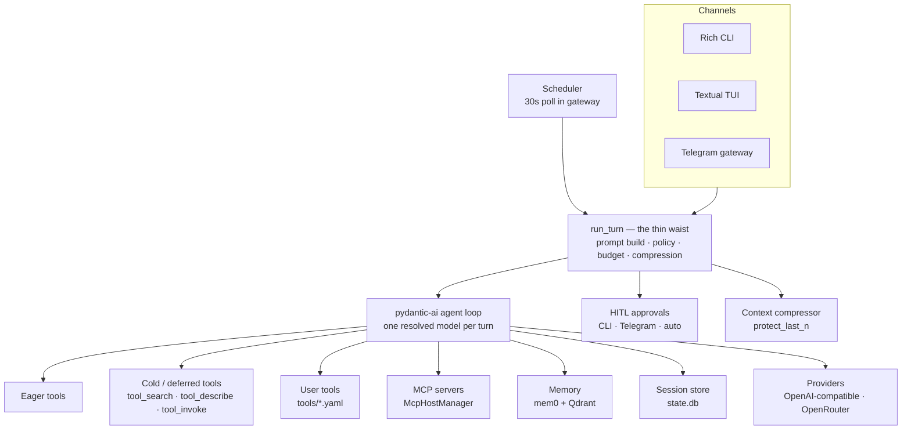

<div align="center">


# Lattice

**A single-user AI agent that runs on your machine — safe by default, extensible with plain files, and observable end to end.**

[](https://github.com/kakalition/lattice/actions/workflows/ci.yml)
[](https://www.python.org/)
[](https://docs.astral.sh/uv/)
[](https://ai.pydantic.dev/)
[](https://textual.textualize.io/)
[](https://python-telegram-bot.org/)

</div>

Lattice is a personal AI agent you run yourself. One narrow, well-tested turn pipeline —
the *thin waist* — powers every way you talk to it: a Rich CLI, a full-screen terminal UI,
and a Telegram bot. Because every channel funnels into the same `run_turn`, your profiles,
memory, tools, safety gates, and telemetry behave exactly the same wherever a message
arrives. One model drives each turn; everything else is composable around it.

## Why Lattice?

Most agent projects are either **frameworks** you wire together yourself or **hosted
assistants** that keep your data on someone else's servers. Lattice is a third option: a
complete, single-user agent that runs locally, behaves identically on every surface, and
stays inspectable.

- **One pipeline, every surface.** The CLI, TUI, Telegram, and scheduled jobs all call the
  same `run_turn`. There is no per-channel behavior to drift, and nothing to reimplement
  when you add another interface.
- **One model per turn, on purpose.** The agent loop, context compression, and memory
  extraction run on a single resolved model (you can point summarization at a cheaper one).
  There are no hidden orchestrator/router/worker layers to debug or pay for — the reasoning
  lives in one loop you can actually follow.
- **Local-first by default.** Sessions, memory, schedules, browser profile, and databases
  live under `.lattice/`; memory is an embedded vector store, not a hosted service. Secrets
  live only in `.env`. One command turns the whole home into a portable archive.
- **Safety is structural, not a prompt.** Destructive and high-blast-radius actions are
  approval-gated, with remembered approvals and a breaker that stops repeated prompting.
  Scripts run sandboxed with network off by default, file tools are jailed to the workspace,
  root-wide scans are refused, and every approval and shell command is written to an audit
  log.
- **Built for months of context, not one chat.** The system prompt is split into a
  cache-stable prefix and a small per-turn tail. Compression protects your most recent
  messages, never splits tool call/result pairs, and carries a compact action ledger,
  recent evidence, and open todos across the boundary.
- **Tools that scale without bloating the prompt.** A small eager set is always visible;
  everything else stays behind a fast, in-process search that works even on providers with
  no native tool search. MCP servers are deferred automatically as the tool list grows.
- **Extensible with plain files, not forks.** Add a skill (`SKILL.md`), a script, a
  declarative tool (`tools/<name>.yaml`), or a profile and persona — changes are live on the
  next turn. No rebuild, no plugin API.
- **Observable and testable offline.** Every turn writes a structured record (phases, TTFT,
  cache tokens, per-tool timing), `lattice stats` summarizes them, and `lattice eval`
  replays recorded model responses through the *real* pipeline so regressions are caught
  without spending tokens.

## Table of Contents

- [Why Lattice?](#why-lattice)
- [Features](#features)
- [Architecture](#architecture)
- [Quick Start](#quick-start)
- [Configuration](#configuration)
- [CLI Reference](#cli-reference)
- [Profiles](#profiles)
- [Tools](#tools)
- [Skills](#skills)
- [Memory & Sessions](#memory--sessions)
- [Scheduler & Reminders](#scheduler--reminders)
- [SQLite](#sqlite)
- [Observability & Eval](#observability--eval)
- [Backup & Restore](#backup--restore)
- [Development](#development)
- [Security & Safety](#security--safety)
- [Project Layout](#project-layout)

## Features

### Talk to it anywhere

- **Terminal chat** — a plain REPL or a full-screen Textual UI, with streamed replies, a
  live "thinking" status, and `/profile`, `/model`, `/sessions`, `/resume`, `/reset`, `/stop`.
- **Telegram** — a DM bot with streamed status edits, inline approve/deny and choice
  buttons, photo and document input/output, Telegram-friendly Markdown, and per-user queues.
- **Scheduled check-ins** — cron or one-shot reminders, delivered verbatim to Telegram, the
  CLI, or nowhere.

### It remembers, and stays coherent

- **Long-term memory** — local mem0 + Qdrant with hybrid (dense + lexical) search. Explicit
  "remember this" is stored verbatim, and a boot self-check catches a silently broken memory
  backend.
- **Sessions that persist** — resume any past conversation and search across them.
- **Long-context handling** — automatic compression protects your latest messages, and the
  action ledger, recent evidence, and todo list survive compaction.

### It actually does things

- **Files & shell** — read, write, edit, and search files; a guarded shell that refuses
  unbounded scans.
- **Web & browser** — search and fetch, plus Playwright automation with a persistent
  profile and humanized input.
- **Documents & media** — OCR, branded PDF generation, and charts; images and PDFs it
  creates are delivered straight to your chat.
- **Databases** — a named SQLite registry with read-only options, safe pragmas, row/time
  limits, automatic backups, and approval-gated destructive statements.
- **Code & compute** — sandboxed Python/Node/Bash scripts and a safe calculator.

### Safe to hand real work to

- **Approval gates** on destructive, high-blast-radius actions, with remembered approvals
  and a breaker that stops it re-asking.
- **Audit trail** — every approval decision and shell command is appended to `audit.jsonl`.
- **Sandboxing** — bubblewrap isolation, network off by default, workspace path jails,
  symlink-safe deletes, and refusal of root-wide scans.
- **Secret hygiene** — API keys and tokens can only ever come from `.env`.

### It adapts to you

- **Profiles & personas** — a per-profile persona (`SOUL.md`), durable user notes
  (`USER.md`), and tool/skill/model/database policy that apply live on the next turn.
- **Skills** — readable `SKILL.md` instructions that load only when relevant.
- **Custom tools** — declare a tool in `tools/<name>.yaml` and it is callable next turn.
- **MCP** — attach Model Context Protocol servers as tools, deferred automatically once the
  tool list grows large.

### You can see and improve it

- **Tool discovery** — cold tools are found by a fast local search instead of bloating every
  request.
- **Prompt caching** — a stable prefix plus session pinning keeps costs down on providers
  that support caching.
- **Observability** — one structured record per turn, and `lattice stats` for outcomes,
  latency, cache hit rate, and tool cost.
- **Offline eval** — replay recordings through the production pipeline; no API keys needed.
- **Backup & restore** — archive and restore the whole agent home in one command.

## Architecture

Every channel converges on `run_turn`, the thin waist. The waist assembles the prompt,
applies profile and channel policy, runs HITL, and drives a pydantic-ai agent loop that can
call eager tools, deferred (cold) tools, user-defined tools, and MCP toolsets. Side systems
provide memory, session persistence, providers, the scheduler, and approvals.



## Quick Start

**Prerequisites:** Python 3.12+ and [uv](https://docs.astral.sh/uv/).

```bash
uv sync --extra dev

uv run lattice init          # create .lattice: layout, default profile, skill starters
uv run lattice doctor        # check config, keys, and profiles

uv run lattice chat -p default   # plain CLI chat
uv run lattice chat --tui        # graphical Textual terminal UI
uv run lattice gateway           # Telegram bot + scheduler
```

The first chat or gateway start runs one-time setup automatically (for example, installing
Playwright Chromium as a fallback). The browser prefers system Chrome and a persistent
profile under `.lattice/browser/profile`; see the `browser:` block in `lattice.yaml`.

## Configuration

Lattice separates non-secret settings, secrets, and runtime data into three layers.

| Layer | Path | Contents |
|-------|------|----------|
| Settings | `lattice.yaml` | Models, timezone, tools, budgets, browser, scripts, SQLite, Telegram tool policy, `default_profile`. |
| Secrets | `.env` | API keys and tokens only. Copy from [`.env.example`](.env.example). |
| Runtime | `.lattice/` | `state.db`, logs, Qdrant, browser profile, scheduler, skills, SQLite backups, workspace, scripts, tools. |

A representative `lattice.yaml`:

```yaml
timezone: Asia/Jakarta

agent:
  primary_model: <provider>/<model>
  iteration_budget: 60
  hitl_timeout_seconds: 600
  turn_timeout_seconds: 600        # legacy alias: idle_watchdog_seconds
  request_timeout_seconds: 120
  # summarizer_model: <cheaper-model>   # defaults to primary_model
  context_pressure_ratio: 0.5      # compress when context passes this fraction
  protect_last_n: 20               # newest messages kept intact when compressing
  prompt_cache: true               # explicit caching for capable OpenRouter models
  prompt_cache_ttl: 5m             # 5m | 1h (1h is Anthropic-only)
  replay_evidence: true            # replay recent reads/queries in the volatile tail
  # context_window_tokens: null    # override; null resolves from the model profile

observability:
  turn_record: true                # one structured JSON line per turn

memory:
  extract_on_turn: false           # off = embed + store the transcript, no LLM call
  self_check: true                 # verify the memory round-trip at boot
  sync_timeout_seconds: 60
  search_timeout_seconds: 0.0      # 0 = unbounded recall

tools:
  allow: ["*"]
  deny: []
  mcp_defer: auto                  # always | auto | never
  mcp_defer_threshold: 8
  search_strategy: bm25            # bm25 (default) | keywords
  search_min_ratio: 0.35           # drop BM25 matches under this fraction of the top score; 0 disables
  eager: []                        # canonical group/leaf globs that force tools eager
  cold: []                         # canonical globs that force tools behind search (wins on conflict)

mcp:
  enabled: true
  servers:
    - name: filesystem             # exposed as filesystem__<tool>; may not be a built-in group
      command: npx                 # stdio transport (exactly one of command | url)
      args: ["-y", "@modelcontextprotocol/server-filesystem", "."]
      env: {}                      # optional environment for the subprocess
    # - name: remote
    #   url: https://example.com/mcp

browser:
  channel: auto                    # auto | chrome | chromium (auto prefers system Chrome)
  headed: false
  persistent_profile: true
  humanize: true

scripts:
  languages: [python, node, bash]
  timeout_seconds: 60
  max_timeout_seconds: 300
  allow_network: false
  require_bwrap: false             # true = refuse to run without bubblewrap

sqlite:
  databases: {}                    # name -> {path, read_only}
  query_row_limit: 500
  query_timeout_ms: 5000

default_profile: default
```

Secrets come only from the project `.env` (see [`.env.example`](.env.example)):

| Key | Purpose |
|-----|---------|
| `OPENROUTER_API_KEY` | OpenRouter key. `OPENAI_API_KEY` is accepted as an alternative. |
| `TELEGRAM_TOKEN` | Telegram bot token for the gateway. |
| `TELEGRAM_CHAT_ID` | Default Telegram destination. |
| `TAVILY_API_KEY` | Web search via Tavily. |

> **Secrets are never read from YAML.** Loading settings scrubs `provider.api_key`,
> `telegram.token`, and `tavily_api_key` out of `lattice.yaml`, so secrets can only come
> from the `.env` file. Legacy `agent.model` is normalized to `agent.primary_model`.

## CLI Reference

| Command | Purpose | Notable flags |
|---------|---------|---------------|
| `lattice version` | Print the version. | — |
| `lattice init` | Create the `.lattice` layout, default profile, and skill starters. | `--reset` (archive + wipe first), `--home` |
| `lattice doctor` | Diagnose config, keys, and profiles. | `--home` |
| `lattice chat` | Interactive chat (CLI or TUI). | `-p/--profile`, `--tui`, `-w` (workspace), `--echo` |
| `lattice gateway` | Run the Telegram bot and scheduler gateway (pidfile-locked). | `--once` (one scheduler pass, no Telegram) |
| `lattice backup` | Compile `.lattice` into a portable archive. | `-o/--output`, `--include-logs`, `--home` |
| `lattice restore <archive>` | Restore an archive into the home directory. | `--force`/`-f`, `--home` |
| `lattice stats` | Aggregate `logs/turns.jsonl` into outcome/latency/cache stats. | `--days`, `--json`, `--home` |
| `lattice eval run` | Replay the eval corpus through production `run_turn`. | `--corpus`, `--json`, `--home` |
| `lattice eval mine` | Draft corpus rows from a real log, plus shell commands from audit. | `--log`, `--audit`, `--out`, `--limit`, `--home` |

## Profiles

A profile bundles a persona, durable user notes, and per-profile policy. `lattice init`
seeds a `default` profile automatically.

```
.lattice/profiles/<id>/
├── profile.yaml   # policy: skills, tools, memory collection, model, sqlite, workspace
├── SOUL.md        # persona: name + who the agent is, personality, style
└── USER.md        # durable notes about the user
```

```yaml
# profiles/<id>/profile.yaml
name: default
description: Default Lattice profile
skills:
  prefer: [telegram-chat, skill-authoring, session-hygiene, web-research]
  disable: []
tools:
  allow: ["*"]
  deny: []
memory:
  collection: lattice-default
# Optional: primary_model, sqlite.allow, workspace
```

- **`SOUL.md`** holds persona. An optional `name:` line sets the assistant's name (default
  `Lattice`); the rest is personality and conversation style.
- **`USER.md`** accumulates durable facts about the user.
- A built-in, immutable operating base ships in `src/lattice/assets/SOUL.md` and is separate
  from persona.
- **Policy precedence:** deny always wins over allow, and per-channel policy
  (`telegram.tools`) narrows the per-profile policy.
- Persona edits take effect on the next turn — no restart required.

## Tools

Lattice ships a core tool set and layers deferred discovery, user-defined tools, and MCP on
top.

### Core tools

Built-ins are grouped into MCP-shaped namespaces. **Canonical** names (`group/leaf`) are
what operator config, HITL, audit, and the ledger use; the **model** sees and calls the wire
form `group__leaf` (double underscore), because providers reject `/` in function names.
Legacy flat names (`sqlite_execute`) and `prefix_*` globs (`sqlite_*`) are normalized on load.

| Group | Tools (canonical) |
|--------|-------|
| `files` | `files/shell`, `files/read`, `files/write`, `files/edit`, `files/remove`, `files/search` |
| `media` | `media/ocr`, `media/pdf`, `media/chart` |
| `web` | `web/search`, `web/fetch` |
| `browser` | `browser/interact`, `browser/snapshot` |
| `compute` | `compute/script`, `compute/calculator` |
| `interaction` | `interaction/clarify`, `interaction/todo` |
| `schedule` | `schedule/add`, `schedule/list`, `schedule/cancel`, `schedule/timezone_get`, `schedule/timezone_set` |
| `memory` | `memory/session_search`, `memory/search`, `memory/add`, `memory/update`, `memory/forget` |
| `sqlite` | `sqlite/list`, `sqlite/schema`, `sqlite/query`, `sqlite/execute`, `sqlite/register`, `sqlite/unregister`, `sqlite/backup` |
| `skills` | `skills/list`, `skills/view` |
| `profiles` | `profiles/list`, `profiles/remove` |

The 11 group names are reserved: user tools live under `user/<name>` and external MCP tools
under `server/tool`, so a server cannot shadow a built-in group.

### Discovery tools

`tool_search`, `tool_describe`, and `tool_invoke` expose the cold tier on demand. On
providers without native tool search, a pinned `search_tools` fallback ranks deferred
tools with in-process BM25 (IDF-weighted, so rare discriminating terms beat ubiquitous
ones; a curated per-tool alias table adds recall for terms like "graph" or "plot").
The `search_tools` description also lists the enabled cold core tools, so the model can
see what discovery reaches without a speculative search. `tools.search_min_ratio`
(default `0.35`) drops matches scoring below that fraction of the best match while always
keeping the top hit; `0` disables trimming. Set `tools.search_strategy: keywords` to
revert to the legacy token-overlap ranking.

### Tiers and policy

- **Eager** tools are always visible; **cold** tools are deferred behind discovery.
  Configure with `tools.eager` / `tools.cold` fnmatch globs matched against canonical
  `group/leaf` names (and built-in defaults).
- **MCP tools** connect to external servers over stdio (`command`/`args`) or streamable HTTP
  (`url`) and are exposed as `server/tool` (wire `server__tool`). `tools.mcp_defer` chooses
  `always`, `auto`, or `never`; `auto` defers once tools exceed `tools.mcp_defer_threshold`
  (default `8`). A server may not reuse one of the 11 built-in group names, and its tool
  names are validated against the provider grammar at discovery.
- **User tools** are declared in `tools/<name>.yaml`, exposed as `user/<name>`, and flow
  through the same policy and HITL checks.
- `compute/script` prefers **bubblewrap** (`bwrap`) for sandboxing. Network access is off by
  default, and `scripts.require_bwrap: true` refuses to run without a sandbox (recommended on
  Linux; macOS falls back to a softer sandbox).

### Tool middleware

Every tool call — built-in, user, or external MCP — passes through one
`GuardedToolset` seam in the same order: **precheck** (tool-specific validation that
must run before any prompt, e.g. an out-of-jail removal), **approval** (`HITL`, driven
by a per-tool policy or the built-in `tool_needs_approval` rules), then **`traced`**
execution (turn events, result truncation, and the repeated-failure breaker). Tool
bodies stay pure, so policy, audit, the action ledger, live-status, and the media
snapshot hook behave identically whether a call is internal or over MCP.

## Skills

Skills are folders with a `SKILL.md` and optional scripts. They use progressive disclosure:
the agent sees each skill's `name` and `description` in the index, then loads the full body
with `skills/view` only when relevant.

```
.lattice/skills/<name>/
├── SKILL.md            # YAML frontmatter: name, description; then instructions
└── scripts/…           # optional helpers invoked via compute/script
```

```markdown
---
name: weekly-review
description: One line describing when the agent should use this skill.
---

Step-by-step instructions the agent follows after loading the skill.
```

Bundled starters include `session-hygiene`, `safe-shell`, `web-research`, `sqlite-admin`,
`scheduling`, `reminder`, `cited-research`, `weekly-review`, `daily-briefing`,
`task-decomposer`, `script-authoring`, `data-pipeline`, `telegram-chat`, `skill-authoring`,
`tool-authoring`, and `profile-authoring`. Skills that ship scripts include `sqlite-admin`
(`scripts/sqlite.py`), `scheduling` (`scripts/schedule.py`), and `profile-authoring`
(`scripts/profiles.py`, `scripts/profile_remove.py`).

The authoring ladder is: start with a skill, add a script via `compute/script`, and only then
graduate to at most one tool manifest. See the `skill-authoring` and `tool-authoring`
starters.

## Memory & Sessions

- **Memory** uses mem0 backed by local Qdrant under `.lattice/qdrant`. Writes are queued to a
  background worker with bounded timeouts and flushed at shutdown.
- A **boot self-check** (`memory.self_check: true`) round-trips an embedding and fails loudly
  if memory would silently return nothing. Fact extraction on each turn is off by default.
- **Sessions** persist to `.lattice/state.db`; `memory/session_search` retrieves prior turns, and
  the context compressor bounds long histories while protecting the most recent messages.

## Scheduler & Reminders

- `schedule/add` / `schedule/list` / `schedule/cancel` manage cron or one-shot jobs.
- Reminders are delivered with verbatim phrasing.
- The gateway polls the scheduler every 30 seconds and delivers to `telegram`, `cli`, or
  `none`. Run `lattice gateway --once` for a single scheduler pass without Telegram.

## SQLite

- Databases are registered by name in `.lattice/sqlite/databases.yaml` and can be marked
  read-only.
- Queries run with WAL, tuned `busy_timeout`/`mmap` pragmas, a 500-row limit, and a 5000 ms
  timeout.
- Destructive DDL is HITL-gated, and Lattice refuses to operate on its own `state.db`.
- `sqlite/backup` writes backups under `.lattice/sqlite/backups`.

## Observability & Eval

- Every turn can be recorded to `logs/turns.jsonl` (`observability.turn_record`), including
  outcomes, latency, TTFT, phases, cache tokens, and tool stats.
- `lattice stats` aggregates those records (use `--days` or `--json`).
- `lattice eval run` replays `tests/eval/corpus` through the production `run_turn` — offline
  cassette replay, no secrets required — and exits non-zero on failure.
- `lattice eval mine` drafts new corpus rows from `logs/lattice.log` and shell commands from
  `audit.jsonl`.

## Backup & Restore

```bash
uv run lattice backup                     # → ./.lattice-<utc>.tar.gz
uv run lattice backup -o ~/lattice.tgz --include-logs

uv run lattice restore ~/lattice.tgz            # empty home only
uv run lattice restore ~/lattice.tgz --force    # displaces existing home to .lattice.bak.<utc>
```

`restore` refuses a non-empty home unless `--force` is given, which moves the existing home
aside first.

## Development

```bash
uv run ruff check src tests       # lint
uv run ruff format src tests      # format
uv run pytest                     # unit tests (default; excludes integration + eval)
uv run pytest -m eval             # offline cassette replay, no secrets
uv run pytest -m integration      # live LLM/Tavily when .env keys are present
```

The test suite lives under `tests/` (roughly 55 modules) with the eval corpus under
`tests/eval/`. CI runs ruff check, `ruff format --check`, unit tests, and eval replay;
integration tests run when `OPENROUTER_API_KEY` is available.

## Security & Safety

- **HITL by default:** high-blast-radius actions are approval-gated. Adapters include
  `CliHitlAdapter`, `TelegramHitlAdapter`, and `AutoApproveHitl`; approvals are remembered and
  a consecutive-denial breaker stops repeated prompting.
- **Auditing:** HITL decisions are written to `audit.jsonl`.
- **Secret hygiene:** secrets live only in `.env`; YAML is scrubbed of secret fields, and the
  system soul instructs the agent never to place secrets in files, scripts, or skills.
- **Untrusted input:** web and tool output is treated as untrusted data, never as
  instructions.
- **Sandboxing:** `compute/script` prefers bubblewrap, disables network by default, and can be
  configured to require a sandbox.

## Project Layout

```
src/lattice/
├── turn.py, agent_app.py, prompt.py, session.py, config.py, events.py, cli.py   # thin waist
├── channel/     # cli, tui, telegram adapters
├── hitl/        # approval adapters, policy, audit
├── context/     # context compression
├── tools/       # core tools
├── mcp/         # MCP host manager and toolsets
├── skills/      # skill loading and progressive disclosure
├── profiles/    # persona + policy loading
├── memory/      # mem0 + Qdrant worker
├── sqlite/      # registry, pool, pragmas
├── providers/   # OpenAI-compatible + OpenRouter
├── scheduler/   # cron / one-shot jobs
└── assets/      # SOUL.md, logos, bundled skill scripts

tests/           # unit + integration + eval corpus
```

<div align="center">

Built for a single user.

</div>
