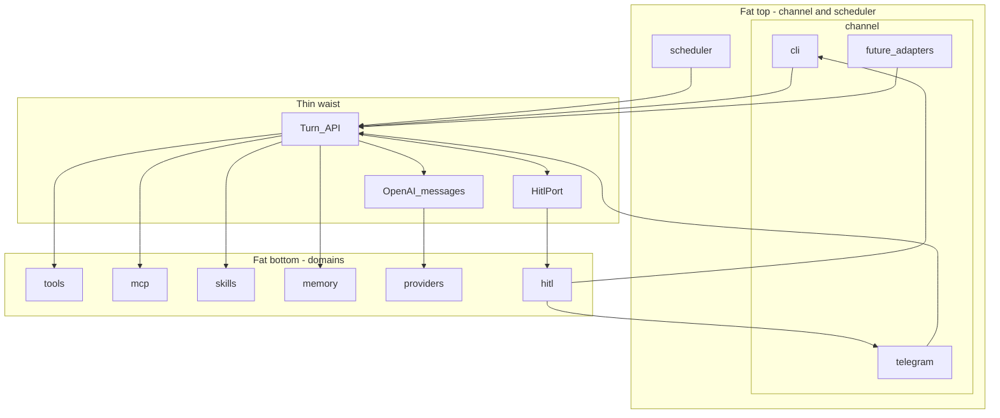
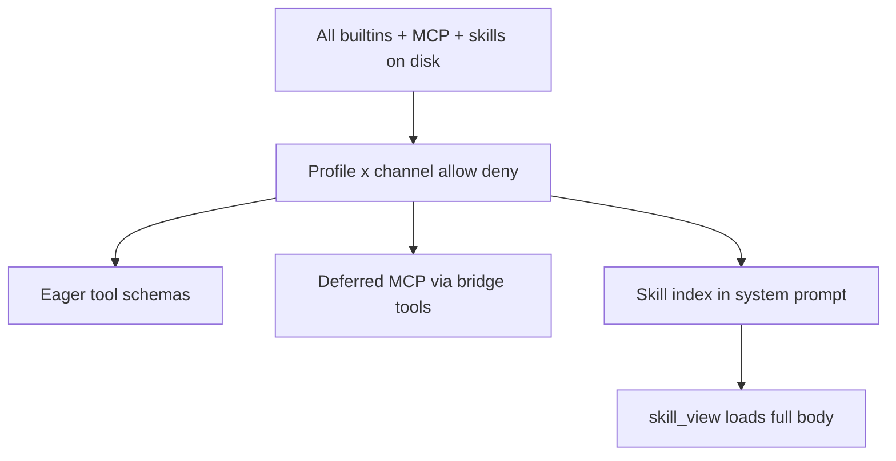

# Lattice: Lean Python Agent Platform (Hermes-inspired)

> **Status:** Parked. Implementation has not started. When you are ready, ask to execute this plan (start with phase 1 — Skeleton).

## Goals

- **Thin waist, fat edges**: one narrow core; diversity lives in clear domain packages at the edges.
- **Domain grouping**: `skills`, `tools`, `mcp`, `providers`, `memory`, `sqlite`, `context`, `channel`, `scheduler`, `hitl`.
- Hermes’s **shape** without sprawl; **Pydantic AI** runs the loop; open protocols (MCP, Agent Skills, OpenAI-compat).
- **Named profiles** (e.g. `finance`) — own system prompt, skills, tool allowlist, memory/session scope; thin waist unchanged.
- **Human-in-the-loop (HITL)** + **full context compressor** + **multi-SQLite manager** in v1.
- **Hermes reliability hardening** in v1 (error taxonomy, deadlines, liveness, persist-before-execute, steer, path denies, …) — gap analysis **F**.

## Thin waist, fat edges (locked)

Hourglass: **keep the middle tiny**; grow domain packages above/below.



### Waist (must stay small)

| Contract | Shape | Rule |
|----------|-------|------|
| `Turn` | `run_turn(Inbound) -> Outbound` | Only harness entry; channel adapters never call the LLM |
| Message log | OpenAI-style messages | One transcript for session + provider |
| `HitlPort` | `approve(...)` / `clarify(...)` | Waist/tools request human input; never import Telegram/CLI UI |
| Deps | Injected (`session`, `memory`, `hitl`, `user_id`, `config`) | No channel-aware globals |

Waist modules: `turn.py`, `agent_app.py`, `prompt.py`, `session.py`, `config.py`. Everything else lives in a **named domain package**.

### Fat domains (grouped packages)

| Package | Owns | Extends by |
|---------|------|------------|
| `channel/` | Surface adapters; **`cli/`** and **`telegram/`** as subpackages | New `channel/<name>/` |
| `scheduler/` | Timed jobs → `Inbound` + delivery | New job defs / triggers |
| `hitl/` | Approval + clarify protocols and channel-backed adapters | New policy or adapter |
| `context/` | Full compressor + aux summarizer client + pressure notices | Thresholds / prompts |
| `tools/` | Builtin tools (shell, files, web, clarify, todo, session_search) | New file under `tools/` |
| `mcp/` | MCP host config, server lifecycle, tool bridge | New server entry in config |
| `skills/` | agentskills.io loader + slash activation | New `SKILL.md` pack |
| `memory/` | `Memory` port + mem0/Chroma impl + memory tools wiring | New backend behind port |
| `sqlite/` | Named multi-DB registry + SQL tools (separate from `session` state.db) | Register another DB path |
| `profiles/` | Named agent personas — prompt, skills, tools, memory/session scope | New profile directory |
| `providers/` | OpenAI-compat client/settings | New provider profile in config |

**Separation rule:** MCP is **not** folded into `tools/`. Skills are **not** tools. HITL UX is **not** in the waist — only `HitlPort`. Channel adapters live **under** `channel/`.

### Anti-patterns

- `if channel == "telegram"` in the waist
- Dumping MCP helpers into `tools/`
- Embedding readline/Telegram bot calls inside `tools/shell.py` — go through `hitl/`
- Flat `channel/telegram.py` when a subpackage is clearer — prefer `channel/telegram/`
- Calling timed jobs “cron” — use **scheduler**
- Second orchestration waist (LangGraph)
- Growing `agent_app.py` with domain logic
- Silent auto-approve of destructive tools on interactive channels

## Standards & protocols (locked)

| Layer | Standard | Domain |
|-------|----------|--------|
| Tools bus | **MCP** | `mcp/` |
| Workflow packs | **Agent Skills** | `skills/` |
| LLM wire | **OpenAI Chat Completions** | `providers/` |
| Agent mesh (later) | **A2A** | edge later |
| IDE (later) | **Editor ACP** | `channel/` later |
| Observability | **OpenTelemetry** | cross-cutting |

## Production library stack (locked)

| Domain / concern | Library |
|------------------|---------|
| Waist loop | **Pydantic AI** |
| Config | **pydantic-settings** |
| `mcp/` | official **mcp** + Pydantic AI MCP |
| `providers/` | OpenAI-compat via Pydantic AI |
| `memory/` | **mem0ai** + **chromadb** |
| `channel/cli` | **typer** + **rich** + **Textual** |
| `channel/telegram` | **python-telegram-bot** v21+ — commands menu, inline/reply keyboards, editMessage, media, callback_query |
| `tools/` web | **httpx** (+ **Tavily** for `web_search`) |
| Sessions | **aiosqlite** |
| Multi-SQLite manager | **aiosqlite** (separate connections from session DB) |
| Logging | **structlog** + OTel |
| Packaging | **uv** |

**No Lang stack** as core.

### Lattice vs Pydantic AI

- **Pydantic AI:** model call, tool execution, MCP connections, deps.
- **Lattice:** `Turn`, `HitlPort`, `TurnEvents`, domains (`channel`, `scheduler`, `hitl`, `context`, `tools`, `mcp`, `skills`, `memory`, `sqlite`, `providers`), `~/.lattice`, gateway.

## Scope (product, locked)

| Area | Decision |
|------|----------|
| Surfaces | `channel/` — `cli` (rich TUI), `telegram` (**full bot UX**, not text-only) |
| Loop | `run_turn` → Pydantic AI; parallel tool calls; iteration budget |
| Builtin tools | Lean set below — **inspired by** Hermes, not a port of 70+ tools |
| HITL | approve + clarify; Telegram inline keyboards + TUI modals; timeout |
| Context | **Full compressor** (aux LLM summarize) + trim fallback |
| Sessions | SQLite + compress lineage (parent/child session ids) |
| Memory | mem0 + Chroma; flush before compress |
| SQLite manager | Several **named** user DBs under `sqlite/` (not the session DB) |
| Skills | agentskills.io loader + starters incl. **sqlite-admin**; **index in prompt**, body via `skill_view` |
| Profiles | Named (e.g. `default`, `finance`) — prompt + skills + tools + isolated memory/sessions |
| Subagents | **Skip v1** — no `delegate_task`; single-agent loop only |
| Scheduler | jobs → Inbound; HITL deny/preapprove |
| MCP | configured servers; **defer schemas** behind bridge when many tools |
| Providers | OpenAI-compat primary + **auxiliary** model for compress/vision |
| Turn events | tool_start/end, status, stream deltas → TUI/Telegram |
| Selective context | Policy ∩ progressive skills ∩ deferred MCP — see **Selective tools & skills** |
| Hardening | Hermes reliability harvest — see gap analysis **F** (error taxonomy, deadlines, liveness, persist-before-execute, steer, path denies, …) |

## Ship list: tools & skills

### Tools (built into Lattice v1)

| Tool | Hermes analogue | Notes |
|------|-----------------|-------|
| `shell` | `terminal` | Local only; timeout; HITL-gated when dangerous |
| `read_file` | `read_file` | Workspace-rooted |
| `write_file` | `write_file` | HITL when outside policy |
| `edit_file` | `patch` / edit | Search-replace style |
| `search_files` | `search_files` | ripgrep if present, else walk |
| `web_search` | `web_search` | **Tavily** backend |
| `web_fetch` | `web_extract` | httpx + readable text extract |
| `clarify` | `clarify` | Via `hitl/` |
| `todo` | `todo` | In-session task list |
| `session_search` | `session_search` | Search past sessions |
| `memory_search` / `memory_add` / `memory_update` / `memory_forget` | memory tools / mem0 plugin | `memory/tools.py` |
| `sqlite_list` | — | List registered DBs |
| `sqlite_schema` | — | Tables/indexes/DDL for a named DB |
| `sqlite_query` | — | Read-only SQL (`SELECT` / CTE); row/byte caps |
| `sqlite_execute` | — | Writes DDL/DML; **HITL-gated**; optional dry-run |
| `sqlite_register` / `sqlite_unregister` | — | Add/remove named DB paths (path allowlisted) |
| `sqlite_backup` | — | Copy DB to `~/.lattice/sqlite/backups/` |
| `skills_list` / `skill_view` | skills tools | Progressive skills; bodies not in system prompt |
| `tool_search` / `tool_describe` (+ invoke) | Tool Search | Deferred MCP long-tail; only when MCP configured |

**Not shipping:** `delegate_task` / subagents (v1). Parallel work = one agent + tools, or later A2A/MCP.

**Also available without shipping code:** any tool from user-configured **MCP servers**.

### Multi-SQLite manager (`sqlite/`)

Lattice **session** DB (`~/.lattice/state.db`) stays internal. Separately, Lattice **manages several user SQLite files**:

```yaml
# ~/.lattice/config.yaml
sqlite:
  databases:
    notes: { path: "~/Documents/notes.db", read_only: false }
    metrics: { path: "~/.lattice/sqlite/metrics.db", read_only: false }
    archive: { path: "/data/archive.db", read_only: true }
  # optional defaults
  query_row_limit: 500
  query_timeout_ms: 5000
```

- Files may live under `~/.lattice/sqlite/<name>.db` (created on register) or absolute/allowlisted paths  
- Connections: `aiosqlite`, one pool/handle per name, WAL recommended  
- **Never** expose raw shell `sqlite3` as the primary path — use tools so caps/HITL/audit apply  
- `state.db` is **not** in the registry (no agent DROP on sessions by accident)

### Tools we are NOT porting from Hermes

Browser stack (Playwright/CDP/Camofox/…), `code_execution` sandbox kernel, `computer_use`, platform bots (`discord_tool`, …), image/video gen, TTS/STT suites, `cronjob_*` as tools (use `scheduler/` domain), checkpoint manager, connect/credential passthrough zoo, home-assistant, etc.

### Skills (v1)

| What | Decision |
|------|----------|
| Format | [agentskills.io](https://agentskills.io) `SKILL.md` under `~/.lattice/skills/` |
| Hermes skill trees | **Do not vendor** |
| Bundled starters | `session-hygiene`, `safe-shell`, `web-research`, **`sqlite-admin`** |
| `sqlite-admin` skill | When to list vs schema vs query; prefer `sqlite_query` before execute; always backup before migrations; explain HITL for writes; never touch `state.db` |

Skills are prompt packs, not tools. SQLite **capability** = tools; SQLite **workflow** = `sqlite-admin` skill.

## Selective tools & skills (Hermes-shaped, v1)

Hermes does **not** send every tool schema + every `SKILL.md` every turn. Lattice mirrors that with three layers. Profiles/channel allowlists shrink the *universe*; progressive disclosure shrinks what the *model sees*.



### Layer 1 — Policy gate (already planned)

Effective tools = `(builtins ∪ MCP) ∩ profile ∩ channel` (deny wins, `sqlite_*` wildcards).  
Finance profile never even *offers* `shell`. Scheduler jobs can further shrink via `preapproved_tools` / job tool allowlist.

### Layer 2 — Skills: progressive disclosure (agentskills.io)

| What model gets | When |
|-----------------|------|
| **Compact index** in system prompt | Every turn: name + one-line description for eligible skills |
| **Preferred skills** (`skills.prefer` in profile) | Listed first / slightly richer blurb; still not full body |
| **Disabled skills** (`skills.disable`) | Omitted from index |
| **Full `SKILL.md` body** | Only after `skill_view(name)` (or slash `/skill name`) |

Ship tools: `skills_list`, `skill_view` (manage/create can wait). Do **not** vendor Hermes skill trees; do **not** paste all skill bodies into the system prompt.

Optional later (Hermes has it): `requires_toolsets` / `fallback_for_toolsets` frontmatter to hide skills when tools are absent.

### Layer 3 — Tools: eager core + deferred long tail

| Bucket | Sent to model as tool schemas? | Lattice default |
|--------|--------------------------------|-----------------|
| **Core builtins** after policy (shell/files/web/clarify/todo/memory/sqlite/session_search/skills_*) | **Yes** — full JSON schemas | Always eager (Lattice’s catalog is lean) |
| **MCP tools** | **No by default** when count is large | **Deferred** behind bridge tools |
| Bridge | `tool_search` → `tool_describe` → invoke | Always available when any MCP server configured |

**Defer trigger (locked):** if enabled MCP tools (post-policy) **> 8** OR config `tools.mcp_defer: always|auto|never` (`auto` = threshold 8). Below threshold, MCP schemas may be eager for fewer round-trips.

**Not shipping Hermes’s full Tool Search complexity in v1** (multi-tier listing budgets, plugin zoo). Ship the **bridge pattern** only: search by name/server/description → describe schema → call. Core Lattice tools stay eager so the agent doesn’t thrash searching for `read_file`.

### Profile example (finance)

- Policy: deny `shell`/`write_file`; allow `sqlite_*`, `web_*`, memory, `skill_*`, bridge  
- Skills index: prefer `sqlite-admin`, `web-research`; others hidden or demoted  
- MCP: e.g. 20 finance MCP tools → **deferred**; model searches “ledger balance” then calls  

### Why this matters

Naive “register everything” → token cost, worse tool choice, prompt-cache churn, wider HITL blast radius. Selective send = **policy first, then index/defer**.

### Package touchpoints

- `skills/loader.py` — scan + index entries; `skills/activate.py` — `skill_view` injection into turn context  
- `tools/` — add `skills_list`, `skill_view`  
- `mcp/bridge.py` — deferred registry + `tool_search` / `tool_describe` / invoke  
- `profiles/load.py` — prefer/disable + tool allow intersect before building Agent tool list  
- `prompt.py` — emit `<available_skills>` index only  

### Hermes harness parity (additions)

| Hermes piece | Lattice v1 |
|--------------|------------|
| Toolsets as named bundles | **Lite** — profile/channel allowlists + optional named groups in config later |
| Skills index + `skill_view` | **Yes** |
| Tool Search / deferred MCP | **Yes** — bridge tools; threshold 8 / `mcp_defer` |
| Full Hermes toolset matrix / GUI session toolsets | **No** |

## Profiles — e.g. finance (v1)

A **profile** is a named agent configuration. Same waist (`run_turn`); different **deps** loaded for that profile.

### What a profile owns

| Layer | Finance example |
|-------|-----------------|
| Identity / system prompt | `profiles/finance/SOUL.md` — “You are a careful personal finance analyst…” |
| User notes | `profiles/finance/USER.md` (optional) |
| Preferred skills | `skills: [sqlite-admin, web-research]` (+ optional profile-local `skills/` overlay) |
| Tool policy | `tools.allow: [sqlite_*, web_*, read_file, clarify, todo, …]` / deny `shell` or gate harder |
| Memory | mem0 `user_id` / Chroma collection `lattice-finance` (isolated from `default`) |
| Sessions | `session_key` includes `profile:` — finance chats don’t mix with default |
| SQLite | Profile can expose a subset: `sqlite.databases: { ledger: … }` or inherit global registry + `sqlite.allow: [ledger]` |
| Model (optional) | Override `model` / `auxiliary_model` per profile |
| Workspace (optional) | `agent.workspace` per profile |

### Layout

```text
~/.lattice/
  config.yaml                 # global defaults + telegram token
  profiles/
    default/
      profile.yaml            # skills, tools.allow/deny, sqlite.allow, model?
      SOUL.md
      USER.md
    finance/
      profile.yaml
      SOUL.md
      USER.md
      skills/                  # optional extras only for this profile
  state.db                    # sessions table has profile_id column
  chroma/                     # collections per profile (or subdirs)
  sqlite/
```

```yaml
# profiles/finance/profile.yaml
name: finance
description: Personal finance analyst
skills:
  prefer: [sqlite-admin, web-research, session-hygiene]
  # disable: [safe-shell]   # optional
tools:
  allow: [sqlite_list, sqlite_schema, sqlite_query, sqlite_execute, sqlite_backup,
          web_search, web_fetch, read_file, search_files, clarify, todo,
          session_search, memory_search, memory_add, memory_update, memory_forget]
  deny: [shell, write_file, edit_file]   # example: finance profile is non-shell
sqlite:
  allow: [ledger, taxes]                 # subset of global registry
memory:
  collection: lattice-finance
```

### How you use it

| Surface | Switch |
|---------|--------|
| CLI | `lattice chat -p finance` or `/profile finance` in TUI |
| Telegram | `/profile` inline keyboard → pick finance; sticky per DM until changed |
| Scheduler | Each job has `profile: finance` |
| MCP / tools | Resolved **after** profile tool policy (intersect with channel allowlist) |

### Mid-conversation switch (locked)

Switching profile (`/profile finance`) **starts a fresh session** under that profile. Old transcript stays under the previous `profile_id` (resume via `/sessions`). Sticky profile only affects *which* profile/session the next message uses — no shared transcript across profiles. Matches “finance memory/chats don’t mix with default.”

### Thin-waist rule

`run_turn(Inbound)` receives `profile_id`. `agent_app` builds deps (prompt, skills, tool subset, memory, sqlite allow) from `profiles.load(profile_id)`. **No** `if profile == "finance"` in the waist — only data-driven config.

### Not a full Hermes clone

Hermes profiles = separate entire `HERMES_HOME` (gateway PID, etc.). Lattice v1 = **one gateway process**, many profiles, shared token, isolated prompt/skills/tools/memory/sessions. Separate bot tokens per profile = later if needed.

## Hermes harness parity

Taken from Hermes agent-loop (keep / skip):

| Hermes harness piece | Lattice v1 |
|----------------------|------------|
| Single platform-agnostic agent loop | **Yes** — `Turn` |
| Prompt tiers (identity / context / volatile) | **Yes** — `prompt.py` + SOUL/USER/skills/memory |
| Tool registry + dispatch | **Yes** — builtins + MCP |
| Parallel tool calls | **Yes** |
| Iteration budget (+ subagent cap) | **Yes** budget; **no** subagent cap needed in v1 |
| Fallback model | **Yes** — `providers/` + classified errors + cooldown |
| Interruptible / cancel | **Yes** — + liveness watchdog + steer |
| Persist-before-execute / tool-pair integrity | **Yes** — session + tool round |
| Path deny-list / file safety | **Yes** — beyond workspace jail |
| **Full context compressor** (summarize middle, protect_last_n, keep tool pairs) | **Yes** — `context/` |
| Memory flush before compress | **Yes** |
| Session lineage after compress | **Yes** — lightweight parent/child ids |
| Auxiliary LLM (compress / vision) | **Yes** — `providers/auxiliary` |
| Preflight pressure threshold (~50%) | **Yes** — configurable |
| Ephemeral pressure / budget notices in prompt | **Yes** |
| Streaming + tool progress callbacks | **Yes** — `TurnEvents` |
| Agent-level todo | **Yes** — `tools/todo.py` |
| session_search | **Yes** — SQLite FTS5 or LIKE |
| HITL approve / clarify | **Yes** — stronger than Hermes defaults |
| Skills | **Yes** — index in prompt + `skill_view` (not full bodies every turn) |
| Deferred / Tool Search for MCP | **Yes** — lite bridge; threshold 8 |
| Subagent delegate | **No v1** — defer; keeps waist thinner |
| 3 API modes (Anthropic/Codex native) | **No** — OpenAI-compat only |
| Anthropic prompt-cache breakpoints | **Defer** — optional later if using Anthropic-compat |
| Trajectory / training export | **No** |
| Browser / 7 terminal backends / code sandbox zoo | **No** |
| MoA / side-question forks / filesystem checkpoints | **No** |
| FTS5-heavy gateway session DB | **Lite** — enough for resume + session_search |
| Credential pools / OAuth refresh matrix | **No** — API keys |

## Package layout (domain-grouped)

```text
src/lattice/
  # --- waist (thin) ---
  cli.py
  config.py
  turn.py                # run_turn + iteration budget + cancel
  events.py              # TurnEvents protocol (stream, tool progress, status)
  agent_app.py
  prompt.py              # tiers + ephemeral pressure notices
  session.py             # SQLite + lineage

  # --- fat domains ---
  channel/
    base.py
    cli/
      adapter.py
      tui.py
    telegram/
      adapter.py
      bot.py
      keyboards.py         # inline + reply keyboards, pagination
      formatting.py        # HTML/MarkdownV2 escape + chunk
      media.py             # inbound/outbound photos, docs, voice stubs
      commands.py          # setMyCommands + slash handlers
  hitl/
    base.py
    policies.py
    cli_adapter.py
    telegram_adapter.py
  context/
    compressor.py        # full Hermes-style summarizer
    pressure.py          # thresholds; trim fallback if aux fails
  scheduler/
    jobs.py
    runner.py
  tools/
    shell.py
    file.py
    web.py
    clarify.py
    todo.py
    session_search.py
  mcp/
    hosts.py
    bridge.py            # deferred MCP: tool_search / tool_describe / invoke
  skills/
    loader.py
    activate.py          # skill_view → inject body into turn context
    tools.py             # skills_list, skill_view
  profiles/
    load.py              # resolve profile.yaml + SOUL/USER + policies
    store.py             # list profiles; sticky telegram→profile map
  memory/
    base.py
    mem0_chroma.py
    tools.py
  sqlite/
    registry.py
    pool.py
    tools.py
  providers/
    openai_compat.py
    auxiliary.py
    settings.py
    errors.py            # FailoverReason taxonomy → retry/compress/fallback/abort
    fallback_cooldown.py
  # cross-cutting helpers used by tools + turn:
  # tools/deadline.py, tools/file_safety.py, runtime cwd ContextVar
```

User data stays domain-mirrored under home:

```text
~/.lattice/
  config.yaml
  .env
  state.db              # sessions include profile_id
  audit.jsonl
  profiles/
    default/
    finance/
  skills/               # global starters
  chroma/
  scheduler/
  sqlite/
    backups/
```

## Channel + scheduler

```python
# channel/base.py
class Channel(Protocol):
    def name(self) -> str: ...
    async def run(self, handler: MessageHandler) -> None: ...
    async def send(self, msg: Outbound) -> None: ...

# every adapter under channel/ + scheduler:
outbound = await run_turn(inbound)
await channel.send(outbound)  # scheduler picks deliver channel from job
```

- CLI: `lattice chat` → `channel.cli`
- Gateway: `lattice gateway` — `channel.telegram` + **scheduler** in one process.
Jobs: `~/.lattice/scheduler/jobs.json` (`deliver: telegram|cli|none`).

## HITL (`hitl/`)

Human-in-the-loop is a **first-class domain**, not an afterthought on shell.

```python
# hitl/base.py
class HitlPort(Protocol):
    async def approve(self, req: ApprovalRequest) -> ApprovalDecision: ...
    async def clarify(self, req: ClarifyRequest) -> str: ...
```

| Mode | When | Behavior |
|------|------|----------|
| **Approve** | Dangerous/gated tools (`rm`, `sudo`, writes outside workspace, …) | Pause turn; ask human; deny → tool error result, continue loop |
| **Clarify** | Model calls `clarify` tool | Ask question (optional choices); return answer as tool result |
| **Scheduler** | Unattended jobs | Default **deny** interactive HITL; optional job-level `preapproved_tools` allowlist |

**Channel UX (v1):**
- CLI: **rich TUI** — multiline, streaming, slash autocomplete, HITL modal
- Telegram: **native bot surface** (see below) — not a plain-text chat shim
- HITL timeout (default 5–15 min → deny/cancel); `/stop` and TUI cancel abort pending HITL

### Telegram-native bot UX (`channel/telegram`) — v1

Use what the Bot API is good at. All of this stays **inside the channel adapter**; the waist still only sees `Inbound` / `Outbound` / `HitlPort` / `TurnEvents`.

| Capability | How Lattice uses it |
|------------|---------------------|
| **Bot command menu** (`setMyCommands`) | `/start`, `/help`, `/stop`, `/sessions`, `/resume`, `/forget`, `/model`, `/tools`, **`/profile`** |
| **Inline keyboards** | HITL; clarify; session pagination; **profile picker**; tool action chips |
| **Callback queries** | Answer callbacks (toast/ack); map `callback_data` → HITL decision or slash action (short tokens, not raw SQL) |
| **Reply keyboard** (optional) | Compact persistent shortcuts (e.g. Stop, Sessions) — removable |
| **editMessageText / editCaption** | Live status (“thinking…”, tool running) then edit into final answer; HITL prompt updates on decide |
| **sendChatAction** | `typing` / `upload_document` while working |
| **Chunking + entities** | Split >4096; prefer **HTML** parse mode with strict escape; plain fallback on error |
| **Disable link previews** | Default off for agent replies (less noise) |
| **Documents / photos in** | Save under workspace; docs as paths in `Inbound`; images → vision via aux/primary when configured |
| **Documents / photos out** | If turn produces a file path (backup DB, export), `sendDocument` / `sendPhoto` instead of pasting blobs |
| **Reactions** (optional) | Ack received message with 👀 while queued |
| **Force reply** | Open-ended clarify when no button choices |
| **Long polling** | Default for personal gateway (webhook optional later) |

**Outbound model extension (channel-facing, not waist LLM format):**

```python
class Outbound:
    text: str
    # channel hints — telegram adapter interprets, CLI ignores
    buttons: list[Button] | None = None      # → inline keyboard
    media_paths: list[Path] | None = None    # → sendDocument/Photo
    edit_message_id: int | None = None       # → edit instead of send
```

`HitlPort` for Telegram = inline **Approve / Deny** (and choice buttons for clarify); `answerCallbackQuery` on press; timeout edits the prompt to “expired”.

**Still out of v1 for Telegram:** groups/supergroups/forums, payment bots, mini-apps, inline-mode query shop, games, arbitrary channel posts.

`HitlPort` is injected per turn from the active channel (or scheduler policy). Tools and the waist never import channel UI.

## Context compressor (`context/`) — v1

Hermes-style **full compressor**, not dumb delete-only:

1. Trigger preflight when transcript ≳ **50%** of model context (configurable); optional mid-turn if still over after tool flood  
2. **Flush memory** (`sync_turn`) first  
3. Summarize the **middle** with **auxiliary** OpenAI-compat model (`providers/auxiliary.py`)  
4. Keep last **N** messages intact (`protect_last_n`, default 20)  
5. Never split `tool_calls` / `tool` result pairs  
6. Persist summary + mark **child session lineage** (parent_id)  
7. If aux fails → **trim fallback** (drop oldest middle) so the turn still proceeds  
8. Inject ephemeral “context was compressed” notice into volatile prompt tier  

```python
# context/compressor.py (conceptual)
async def compress(messages, *, aux: AuxiliaryClient, protect_last_n: int) -> CompressResult: ...
```

## Memory (`memory/`)

```python
Memory.from_config({
  "vector_store": {
    "provider": "chroma",
    "config": {
      "path": str(Path.home() / ".lattice" / "chroma"),
      "collection_name": "lattice",
    },
  },
})
```

Prefetch + `sync_turn`; tools in `memory/tools.py`. Include **`memory_forget`** (delete by id / search). Agent identity is **`profiles/<id>/SOUL.md` + `USER.md`** only (loaded by `prompt.py`) — not a second memory system and not global `~/.lattice/SOUL.md`.


## Thorough gap analysis (post-HITL lesson)

First hardening pass optimized for **ops/security** and missed **interaction loops** (HITL). Same blind-spot categories below — anything that pauses, waits, multiplexes, or carries untrusted bytes across the waist.

### A. Interaction & control loops → v1

| Gap | Why it matters | Decision |
|-----|----------------|----------|
| HITL timeout | Without it, Telegram approve hangs forever | Deny after timeout; surface tool error |
| Busy-session policy | Second message while turn/`hitl` active | **Queue** (bounded) + **steer** (inject after next tool) + interrupt; do not drop |
| Cancel vs HITL | `/stop` during approve/clarify | Cancel wins; pending HITL aborted |
| Slash commands | Resume, help, stop, model | Minimal set on shared command router |
| Session list/resume | Personal agent without history UX is crippled | `/sessions`, `/resume <id>` |
| Turn liveness | Silent stall (no error) wedges Telegram | Idle watchdog (~600s) hard-aborts turn |

### B. Channel reality (Telegram) → v1

Covered by **Telegram-native bot UX** (menus, inline keyboards, editMessage, media, typing, chunking). Remaining hard rules: allowlist, DM-only, bounded queue, `update_id` dedupe, safe short `callback_data`.

### C. Context & untrusted data → v1

| Gap | Why it matters | Decision |
|-----|----------------|----------|
| Tool result truncation | Huge shell/MCP output blows context | Hard char/token cap + “truncated” marker |
| Untrusted content labeling | web_fetch / page text = prompt injection | Untrusted fences in tool formatting |
| Full context compressor | Long chats lose coherence with trim-only | **`context/` summarizer** + trim fallback |

### D. Process & lifecycle → v1

| Gap | Why it matters | Decision |
|-----|----------------|----------|
| Single gateway instance | Two processes = double replies / DB fights | Pidfile lock on `lattice gateway` |
| Graceful shutdown | SIGTERM mid-tool | Cancel turn, flush session/memory, close MCP |
| Scheduler timezone + failure notify | Silent cron failures | Timezone in config; on failure `channel.send` error to deliver target |
| First-run setup | Empty `~/.lattice` is hostile | `lattice init` / setup wizard (API key, telegram allowlist, workspace) |

### E. Safety, audit, privacy → v1

| Gap | Why it matters | Decision |
|-----|----------------|----------|
| Audit log | “What did it run / did I approve?” | Append-only `~/.lattice/audit.jsonl` (tool + approval decisions) |
| Per-channel tool allowlist | Telegram shell ≠ CLI shell risk | Config `tools.allow` / `tools.deny` per channel |
| Memory forget | Personal data hygiene | `memory_forget` + `/forget` slash helper |
| Token/cost accounting | Personal budget | Per-turn usage in session metadata + `doctor` summary |
| Path deny-list | Workspace jail still allows `~/.ssh` / `.env` / `state.db` | `tools/file_safety.py` deny absolute secret paths |
| Session approval memory | Re-HITL every identical dangerous cmd | Approve-once per session + consecutive-denial breaker |

### F. Reliability & durability (Hermes harvest) → v1

Steal **patterns**, not mixin sprawl. Owned by todo `hardening` / phase 11.

| Gap | Why it matters | Decision |
|-----|----------------|----------|
| Classified API errors | Blunt “fallback” mishandles 429 vs overflow vs format | Taxonomy → retry / compress / fallback / abort |
| Unified deadline | Scattered timeouts hang differently | One bound for model/tool/MCP/HITL; kill process trees on shell |
| Empty / truncated completions | Proxies return empty “ok” or cut mid tool-call JSON | Retry + token boost; then fallback |
| Persist-before-execute | Crash mid-tool → replay / orphan tool pairs | Append assistant tool_calls before side effects; close interrupted pairs |
| Byte-stable system prompt | Mid-turn rebuild thrash caches | Prompt fixed for turn; skill/steer inject as user or tool result |
| Parallel tool hygiene | Hung workers / mismatched tool_call_ids | Ordered results, batch deadline, cancel fanout |
| Fallback cooldown | Primary↔fallback oscillation on 429 | Exponential cooldown before restoring primary |
| Resume sanitization | Surrogates / dup tool_call_ids → hard 400s | Sanitize on session load |
| Per-turn ContextVar cwd | Multi-profile gateway races process cwd | ContextVar for shell/files |

### G. Defer (conscious, not forgotten)

| Item | Why later |
|------|-----------|
| Anthropic-native prompt-cache breakpoints | Only matters on Anthropic-compat endpoints |
| Browser automation, Docker sandbox | Non-goals |
| Secret vaults, OAuth refresh | Personal API-key v1 OK |
| Separate Telegram bot token per profile | One bot + `/profile` sticky map in v1 |
| Voice memos / full multimodal suite | Images+docs first |
| Background process registry | Timeout shell only |
| A2A, editor ACP, webhooks | Edge hooks only |
| Trajectories, MoA, side-question forks, FS checkpoints | Hermes research baggage |
| **Subagents / `delegate_task`** | Skipped in v1 |
| Multi-instance distributed lock | Pidfile enough |
| User hooks dir, ESTOP, delivery ledger, blob-to-disk, session titles, LLM guardian, microcompaction | v1.1 reliability polish |

### Still locked defaults

- CLI cwd = process cwd; Telegram/scheduler = `agent.workspace` (overridable per profile); per-turn **ContextVar cwd** in gateway
- Telegram HITL = **inline keyboards** + callback ack; CLI = **rich TUI**
- Telegram channel uses **native bot UX**
- Busy policy = **bounded queue** + **steer** (inject after tool) + interrupt
- Compress at ~50% context; `protect_last_n=20`
- Active profile sticky per CLI session / Telegram DM until changed
- API failures classified → retry / compress / fallback / abort; primary restore uses cooldown
- System prompt byte-stable within a turn; skill bodies via tool/user inject not mid-turn system rewrite

## Implementation phases

1. **Skeleton** — waist + HitlPort + TurnEvents + providers + **profiles stub** (`default`) + init/doctor  
2. **Tools + sessions + hitl** — sessions carry `profile_id`  
3. **`context/` full compressor**  
4. **`memory/`** — per-profile collection  
5. **`sqlite/`** — registry + profile `sqlite.allow`  
6. **`profiles/` complete** — SOUL/skills/tools; `lattice chat -p`; Telegram `/profile`  
7. **Rich TUI** — profile indicator + HITL  
8. **Telegram** — native bot UX + profile picker  
9. **Web + skills starters + todo + session_search**  
10. **Scheduler + MCP** — jobs bind `profile:`  
11. **Hardening** — Hermes harvest: error taxonomy, unified deadlines, liveness watchdog, empty/trunc recovery, persist-before-execute, byte-stable prompt, parallel-tool hygiene, approval memory, path denies, steer, fallback cooldown, resume sanitization, ContextVar cwd; plus retries, pidfile, tests, cost accounting  

## Non-goals

- Fattening the waist; `if profile == "finance"` in core (use config)
- Separate full process/`HERMES_HOME` per profile (one gateway, many profiles)
- Naming timed jobs “cron” — use **scheduler**
- Plural top-level `channels/`
- LangChain / LangGraph / LangSmith as core
- Lattice-specific tool protocol
- 25 messaging platforms in-tree
- Multiple terminal sandboxes / browser automation
- Native Anthropic/Codex modes in v1
- A2A / editor ACP / webhooks in v1
- Forking Hermes
- Subagents / `delegate_task` in v1
- Secret vaults, Docker sandbox, training trajectories, voice-first (v1)
- Anthropic-native prompt-cache breakpoints in v1
- Trajectories, MoA, multi-API-mode sprawl

## Success criteria

- CLI and Telegram share one `run_turn`
- **Profiles** switch prompt, skills, tools, memory, sqlite allowlist (`-p finance` / `/profile`)
- Finance-style profile can deny `shell` and prefer `sqlite-*` + `sqlite-admin` without code changes
- Skills: **index in prompt**, full body only via `skill_view`; MCP long-tail **deferred** behind bridge when >8 (or `mcp_defer`)
- HITL via Telegram inline keyboards + rich TUI; timeout; cancel
- Telegram native bot UX (menus, editMessage, typing, media, chunking)
- Busy sessions queue; DMs only; safe callback_data
- Multi-SQLite tools + `sqlite-admin` skill; session DB not in registry
- Full context compressor; iteration budget; TurnEvents
- **Hardening:** classified API recovery, unified deadlines, liveness watchdog, empty/trunc recovery, persist-before-execute, byte-stable prompt, parallel-tool hygiene, approval memory, path denies, steer, fallback cooldown, resume sanitization, ContextVar cwd
- No nested subagents in v1
- Waist stays small as domains grow

## Pre-implementation audit (2026-09-10)

**Verdict:** Product architecture is locked enough to implement. Remaining work is **schema/contracts + a few OR picks**, not missing product domains. Repo is greenfield (`main.py` stub, empty deps) — no Lattice harness on disk yet. Canonical plan = **this file**; retire competing distill/lenses plan if still open.

### Solid (no further debate)

Thin waist + domains, Python/Pydantic AI, OpenAI-compat, CLI+Telegram, HITL domain, full compressor, multi-SQLite ≠ `state.db`, profiles (one gateway), no subagents v1, Telegram DM-only native UX, defer list (browser/OAuth/A2A/ACP/voice-first/…).

### Doc drift to fix when executing

- Plan filename still `lattice_go_agent_*` (content is Python)
- Mermaid omits `context` / `sqlite` / `profiles` / `skills`
- `hitl` todo overlaps `harness-tools` — adapters in `hitl/`, gates in tools phase

### Must lock before skeleton (defaults proposed)

| Topic | Proposed default |
|-------|------------------|
| Identity files | **Profile-only** `profiles/<id>/SOUL.md` + `USER.md`; `default` profile always exists; no global SOUL |
| Tool policy merge | **Deny wins**: effective = (builtins ∪ MCP) ∩ profile.allow − profile.deny ∩ channel.allow − channel.deny; support `sqlite_*` wildcards |
| Workspace jail | File tools always rooted at **effective workspace** (CLI: cwd unless `-w`/config; Telegram/scheduler: `agent.workspace` or profile override) |
| `state.db` writers | **WAL + asyncio lock** in-process; document “don’t run two gateways”; CLI and gateway may share DB via WAL |
| HITL + Pydantic AI | **Approve before tool dispatch** (wrapper checks policy, then runs tool); clarify as a normal tool that awaits `HitlPort` |
| TUI | **Textual** (not prompt-toolkit) |
| Web search | **Tavily** (single backend; Brave later if needed) |
| `Inbound` minimal | `text`, `session_id?`, `profile_id`, `user_id`, `channel`, `media_paths?`, `cancel` |
| HITL timeout | **10 min** default |
| Iteration budget | **40** model↔tool rounds default (overridable in config/profile) |

### Fine during implement

Exact dangerous-command patterns, queue depth, FTS vs LIKE, cron expression shape, audit field names, mem0 embedding model, OTel exporter, skill markdown copy, MCP YAML shape, slash `/model` persistence details, packaging extras.

### Still open for user (if defaults rejected)

- Web search backend (Tavily vs Brave)
- TUI library (Textual vs prompt-toolkit)
- Confirm profile-only SOUL (vs global + overlay)

## Hermes engineering harvest (locked into v1)

Canonical decisions live in gap analysis **F** + phase 11 + todo `hardening`. Summary: steal Hermes **failure-mode patterns** (error taxonomy, deadlines, liveness, empty/trunc recovery, persist-before-execute, prompt stability, parallel-tool hygiene, approval memory, path denies, steer, cooldown, resume sanitization, ContextVar cwd). Defer hooks/ESTOP/delivery ledger/titles/guardian/microcompaction to v1.1. Keep out checkpoints, credential pools, MoA/trajectories, subagents, platform zoo.
